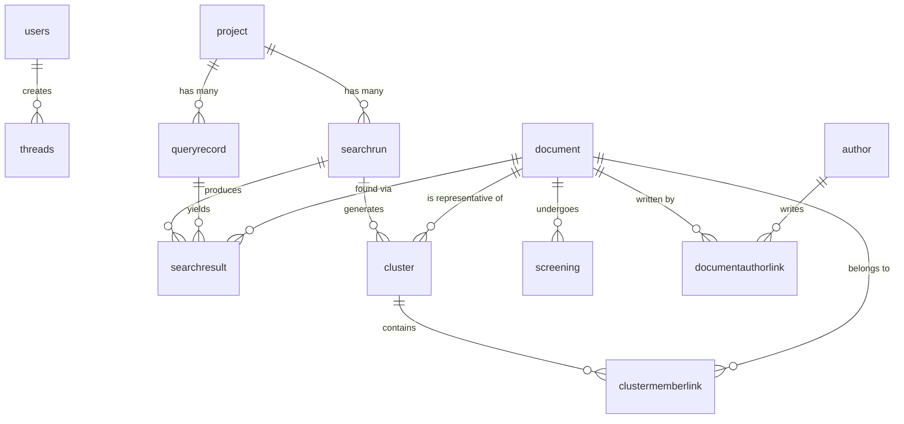

# Nexus Platform Database Schema

The Nexus platform uses a shared PostgreSQL database (`nexus`) to power both the frontend orchestration (Scout/Laravel) and the backend research engine (Nexus API/Python).

## 📊 High-Level Entity Relationship

---

## 🏎️ Scout (Laravel) Tables
These tables handle user authentication, session management, async job queues, and the high-level project "Threads" managed by the frontend React application.

### `users`
Core authentication table managed by Laravel Fortify.
| Column | Type | Description |
|--------|------|-------------|
| `id` | bigint (PK) | Primary Key |
| `name` | varchar | User's full name |
| `email` | varchar | User's email (Unique) |
| `password` | varchar | Hashed password |
| `two_factor_secret` | text | 2FA secret key |
| `created_at` | timestamp | Creation time |
| `updated_at` | timestamp | Last update time |

### `threads`
The high-level research project state managed by the user before handing off to the Nexus Python API.
| Column | Type | Description |
|--------|------|-------------|
| `id` | uuid (PK) | Unique thread identifier |
| `user_id` | bigint (FK) | References `users.id` |
| `objective` | text | The user's initial research objective |
| `theme_context` | varchar | Domain/Theme context |
| `status` | varchar | e.g., 'clarification_pending', 'running' |
| `questions` | json | Clarification questions for the user |
| `answers` | json | User's answers to the questions |
| `nexus_yaml` | text | The generated protocol configuration |
| `created_at` | timestamp | |
| `updated_at` | timestamp | |

*(Standard Laravel infrastructure tables like `jobs`, `failed_jobs`, `sessions`, `cache`, and `migrations` are also present but omitted for brevity).*

---

## 🧠 Nexus API (Python/SQLModel) Tables
These tables represent the core data models of the literature review engine, tracking projects, search runs, academic papers, deduplication clusters, and AI screening results.

### `project`
Top-level container for a research effort.
| Column | Type | Description |
|--------|------|-------------|
| `id` | uuid (PK) | Project UUID |
| `name` | varchar | Project Name |
| `description` | varchar | Optional description |
| `config` | json | Configuration parameters |
| `created_at` | timestamp | |

### `searchrun`
Tracks a specific execution of a search across providers (OpenAlex, PubMed, etc.).
| Column | Type | Description |
|--------|------|-------------|
| `id` | uuid (PK) | Run UUID |
| `project_id` | uuid (FK) | References `project.id` |
| `run_id` | varchar | Human-readable ID (e.g. '20260321_120000') |
| `status` | varchar | pending, running, completed, failed |
| `config_snapshot`| json | The config used for this run |
| `started_at` | timestamp | |
| `completed_at` | timestamp | |

### `queryrecord`
Database record of a specific boolean search query used in a project.
| Column | Type | Description |
|--------|------|-------------|
| `id` | uuid (PK) | Query UUID |
| `project_id` | uuid (FK) | References `project.id` |
| `query_id` | varchar | e.g., 'Q01' |
| `text` | varchar | The boolean query string |
| `category` | varchar | Query category |

### `document`
The unified academic paper/document representation across all providers.
| Column | Type | Description |
|--------|------|-------------|
| `id` | uuid (PK) | Internal Document UUID |
| `title` | varchar | Document title |
| `year` | integer | Publication year |
| `abstract` | varchar | Abstract/Summary |
| `venue` | varchar | Journal/Conference name |
| `doi` | varchar | Digital Object Identifier (Unique) |
| `arxiv_id` | varchar | arXiv ID |
| `pubmed_id` | varchar | PubMed ID |
| `openalex_id` | varchar | OpenAlex ID |
| `raw_data` | json | Original JSON from provider |

### `author`
Unique author information.
| Column | Type | Description |
|--------|------|-------------|
| `id` | uuid (PK) | Author UUID |
| `family_name` | varchar | Last name |
| `given_name` | varchar | First name |
| `orcid` | varchar | ORCID Identifier (Unique) |

### `searchresult`
The link between a search run, a query, and a document from a specific provider.
| Column | Type | Description |
|--------|------|-------------|
| `id` | uuid (PK) | Result UUID |
| `search_run_id`| uuid (FK) | References `searchrun.id` |
| `query_id` | uuid (FK) | References `queryrecord.id` |
| `document_id` | uuid (FK) | References `document.id` |
| `provider` | varchar | e.g., 'arxiv', 'openalex' |
| `provider_doc_id`| varchar| ID from the specific provider |
| `rank` | integer | Search rank position |

### `cluster`
A cluster of documents identified as duplicates during the deduplication phase.
| Column | Type | Description |
|--------|------|-------------|
| `id` | uuid (PK) | Cluster UUID |
| `search_run_id`| uuid (FK) | References `searchrun.id` |
| `representative_id`| uuid (FK)| References `document.id` (The canonical paper) |
| `strategy` | varchar | Dedup strategy used |
| `confidence` | float | Confidence score (0.0 to 1.0) |

### `screening`
Decisions and metadata from the AI document screening process.
| Column | Type | Description |
|--------|------|-------------|
| `id` | uuid (PK) | Screening UUID |
| `document_id` | uuid (FK) | References `document.id` (Unique) |
| `decision` | varchar | pending, include, exclude, maybe |
| `reason` | varchar | AI generated reason |
| `confidence` | integer | AI confidence score |
| `layers` | json | Multi-layer screening data |

### Link Tables (Many-to-Many)
*   **`documentauthorlink`**: Maps `document_id` to `author_id` (includes `author_order`).
*   **`clustermemberlink`**: Maps `cluster_id` to `document_id` (the papers making up a duplicate cluster).
